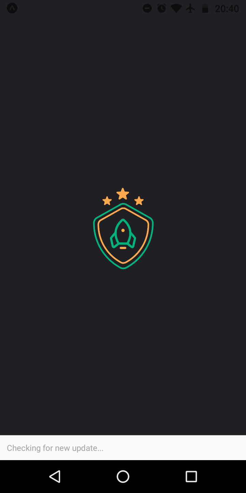
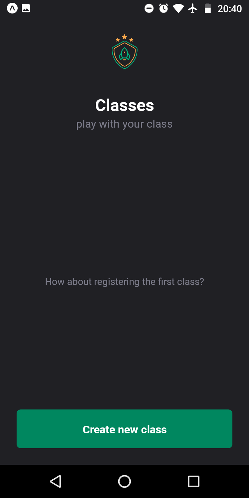
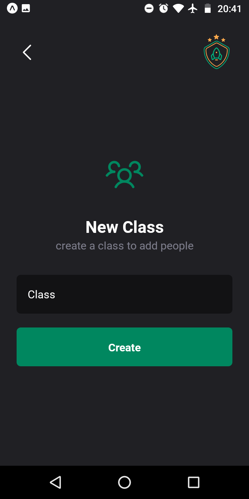
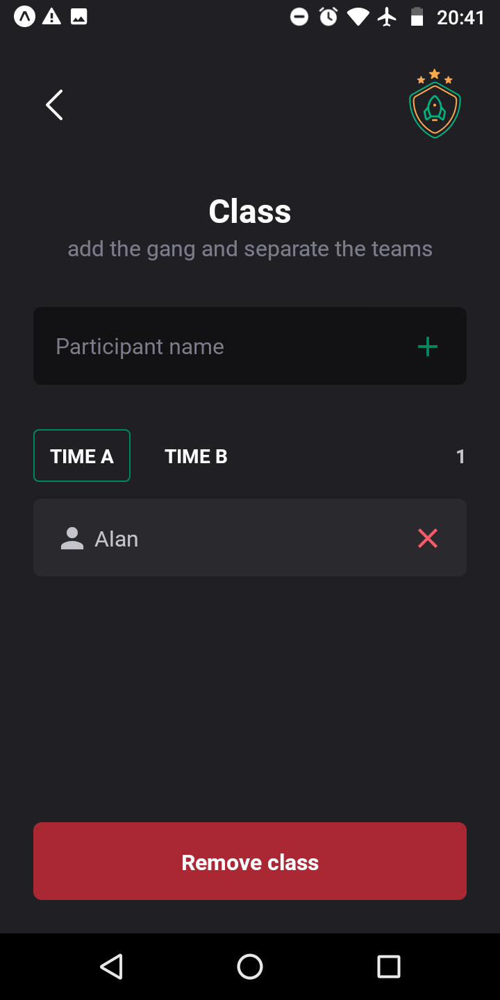
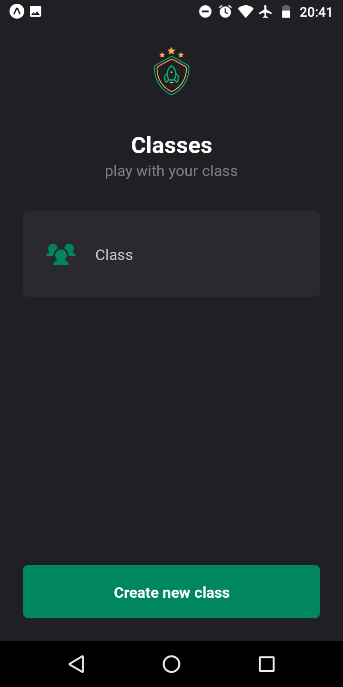

<p align="center">
  
</p>

<h1 align="center">Teams</h1>
<p align="center">Class team organization mobile app!</p>

<h3 align="center">

  <a href="./LICENSE" target="_blank">
    
  </a>

</h3>

<br />

<p align="center">
    
    
</p>
<p align="center">
    
    
</p>
<p align="center">
    
</p>

<br />

# Techs

-  Expo
-  Phosphor
-  Typescript
-  React Native
-  Styled Components

## Installation of dependencies and local use

<br />

>> ### [Documentation Expo](https://docs.expo.dev/)

<br />

> Create somewhere on your pc, a folder to create a copy of the repository, inside it open command terminal and type the commands below:

```
git clone https://github.com/AlanWehrliLC/teams.git
cd teams
npm install
npm run start
```

<br />

> Test the app using expo

>>#### [Teams](https://expo.dev/@alanwehrlilc/teams)